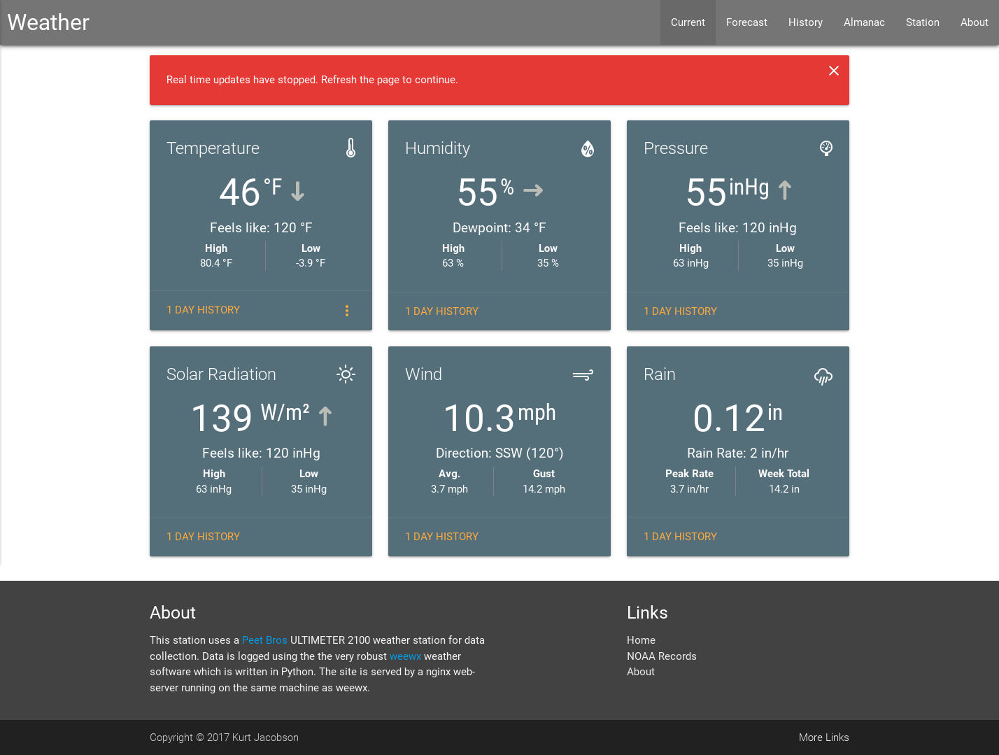
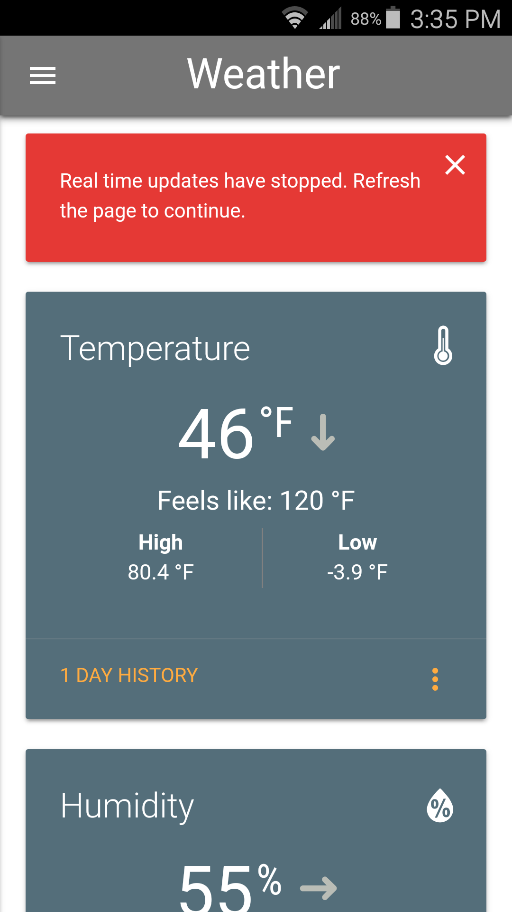

# Materialize WX

A [Materialize](http://materializecss.com/) based skin for [WeeWx](http://www.weewx.com/).
This skin is in very early development and is not functional.

These are some of the (overly ambitious?) goals for this project:

  * Real time data update via WebSockets
  * Dynamic data plots via [HighCharts](https://www.highcharts.com/)
  * Hourly and extended forecast pages
  * Responsive card style layout
  * Attractive appearance
  * Fast load time on desktop and mobile
  * Some kind of basic blog/news page for weather and station discussion
  * Email notifications for all time Hi/Low records etc.

# Screen Shots

## Desktop

## Mobile
